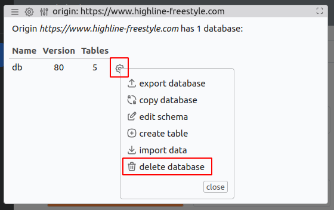

# Highline Freestyle App State Records

This repo is meant for keeping records of the Local Storage and the (Dexie)
IndexDB of the [Highline Freestlye App](https://github.com/bastislack/highline-freestyle).
This is for development purposes only and can be used to set the websites back
to an older data state to check migrations or import scripts.

## Structure
All exports are stored in folders of the following structure:
```
/exports/<commit iso date>_<commit hash>_<"std" | "mod">_<optional comment>/
```
Each export belongs to the commit that was used to create the data. This way
it is possible to track which commit produced which export.

The "std" or "mod" indicates whether this is the state of the database when it
is freshly loaded for the first time ("std") or whether it has been modified by
for example adding custom tricks etc. ("mod").

If there is anything special about the file, like indicating the kind of
modifications done, append a short comment to the name.

Inside these folders can be up to three files:
- `indexdb.dexie` contains the state of the IndexDB
- `localstorage.json` contains the state of the Local Storage
- `README.md` contains additional information if needed.

## Loading a snapshot
Loading a state consists of two parts: The IndexDB and the Local Storage. Beware
that this will fully override both.

### 1. IndexDB (Dexie)
1. Install [Kahuna IndexedDB-Manager](https://addons.mozilla.org/en-US/firefox/addon/kahuna-the-indexeddb-manager/) browser extension
2. With the running Highline Freestyle App (production or development) run the extension by clicking on it in the top right of the browser
3. With the Kahuna window open you should see the Database showing up. Click on the gear next to it and then "delete database". Confirm that you want to delte the database. 
4. Still in the Kahuna window click on "import" > "select file". Now select your .dexie file
5. Done. You might have to reload the website.

### 2. Local Storage
This isn't great but it works. We need to overcome the obstacle of loading a
local file into the local storage of a website. The solution here will be to
simply not do that and copy the entire thing over via the clipboard.

1. To get the json to the clipboard run the following command in your (Linux) terminal:
   ```sh
   cat <path to your file> | jq '@json' | xclip -selection c
   ```
   (If xclip is not available for you, simply remove it and the pipe (`|`) and just copy the terminal output)
2. On the Highline Freestyle Website open the console and run the following code snipped with your clipboard content inserted in the marked place:
   ```js
   localStorage.clear();
   var data = JSON.parse(/* Your clipboard content here */);
   Object.keys(data).forEach(function (k) {
     localStorage.setItem(k, data[k]);
   });
   ```
Done.

## Creating a snapshot

### 1. IndexDB (Dexie)
1. With the website open, open Kahuna. Klick on the Database listed, then on the gear and "export database"
2. Adjust the file name if needed and click on "export". This should download the .dexie file.
3. Move the file from your download directory to the appropriate directory.

### 2. Local Storage
1. Open the console on the Highlien Freestyle App / Website and run:
   ```js
   copy(JSON.stringify(localStorage));
   ```
   This copies the local storage data as json to your clipboard
2. Create an empty localstorage.json file in the [appropriate location](#structure) and paste the content of your clipboard into it. Save the file.
